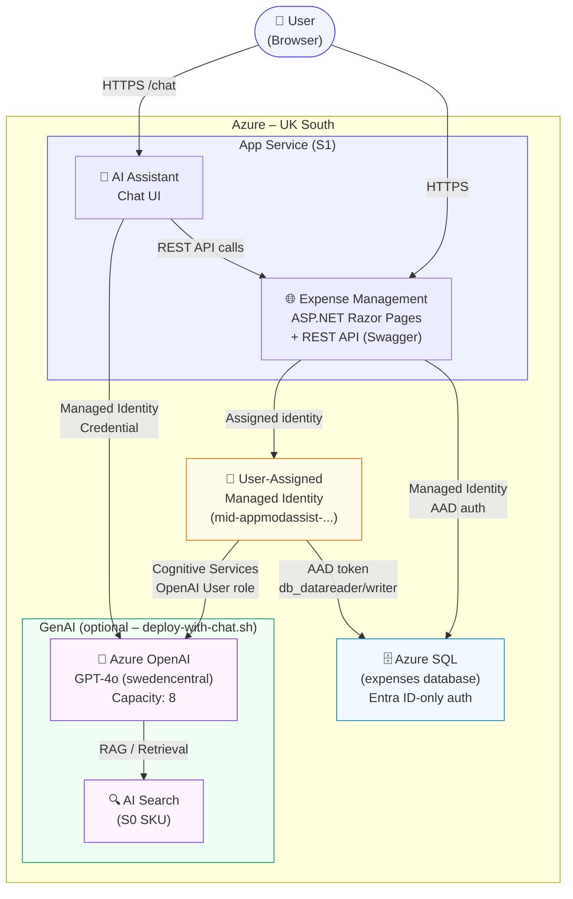

# Azure Services Diagram

This diagram shows the Azure services deployed by this repository and how they connect to each other.



## Architecture Notes

| Service | SKU | Region | Purpose |
|---------|-----|--------|---------|
| App Service Plan | S1 Standard | UK South | Hosts the ASP.NET app – no cold start |
| App Service | — | UK South | Expense Management web app + REST API |
| User-Assigned Managed Identity | — | UK South | Passwordless auth between App Service, SQL, and OpenAI |
| Azure SQL Server | — | UK South | AAD-only auth, no SQL passwords |
| Azure SQL Database | Basic | UK South | `expenses` database (development tier) |
| Azure OpenAI | S0 | Sweden Central | GPT-4o model (quota availability) |
| AI Search | S0 | UK South | RAG document retrieval |

## Authentication Flow

```
App Service
    └─► Uses User-Assigned Managed Identity (AZURE_CLIENT_ID env var)
            └─► Azure SQL: "Authentication=Active Directory Managed Identity;User Id=<clientId>"
            └─► Azure OpenAI: ManagedIdentityCredential(clientId) → Cognitive Services OpenAI User role
```

## Deployment Options

| Script | GenAI | Description |
|--------|-------|-------------|
| `bash deploy.sh` | ❌ | Deploys App Service + SQL + app code. Chat UI shows placeholder. |
| `bash deploy-with-chat.sh` | ✅ | Full deployment including Azure OpenAI and AI Search. |
